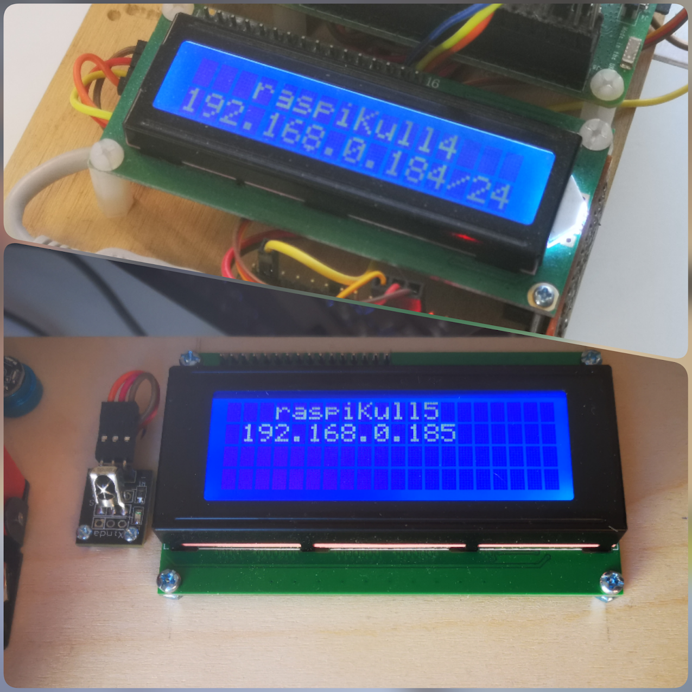
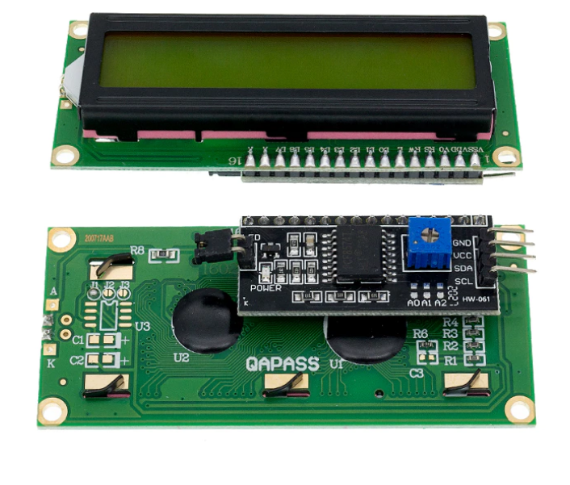

# README: /ros_lcd_driver/ #

ROS1 repository in the https://github.com/Pet-Series Git-Organizations.</br>
Containing a ROS1-package.

## **What is this folder for?** ##

ROS1-package that publish text, via ROS1-topics, on an physical I2C-Display.</br>
This packages also contains a ROS1 test publisher.</br>

<table>
    <tr>
        <td>
            
        </td>
        <td>
            Display any string on the LCD-Display via ROS1-topics.</br>
            * ROS1-topic `lcd_display/row1` => LCD-display row1</br>
            * ROS1-topic `lcd_display/row2` => LCD-display row2
        </td>
    </tr>
</table>


## **How do I set up the Hardware?** ##

*   **Hardware:** Display LCD1602A (LCD2040) LCD Display - 16x2 Character LCD Backlight.
*   **Hardware:** I²C interface PC8574T - Piggyback on the backisde of the display.</br>
    *   **Software:** Pyhton library "`from rpi_lcd import LCD`" that supports LCD text displays (20x4, 16x2 and other) via the I²C converter.</br>
        ```
        $ pip install rpi-lcd
        ```
        <table>
            <tr>
                <td>
                    
                </td>
                <td>
                    Display LCD1602A with I²C interface PC8574T
                </td>
            </tr>
        </table>
* **Hardware:** I²C wire between the PC8574T and the Raspberry Pi.
* **Hardware:** Raspberry Pi (aka. Target System)
  * **Operating system:** Linux/Raspian Buster (based on Debian 10)
  * **Middleware:** ROS 1.0 Melodic

## **How do I set up the ROS1-package?** ##
```
$ cd <your ROS-workspace>
$ git clone https://github.com/Pet-Series/ros_lcd_driver.git
$ catkin build ros_lcd_driver
```

## **How do I launch the ROS1-package?** ##
1. Launch main ROS-system (on the Target System) 
   ```
   $ roscore
   ```
2.  Launch the the LCD-display-driver-node (on the Target System)</br>
    There is two ways to launch the LCD-display-driver-node-subscriber (select ONE of them)

    1. Launch alternative: Via a launch file (recommended)
       ```
       $ roslaunch ros_lcd_driver ros_lcd_driver.launch
       ```
       Note:warning: By using the .launch file you could `<remap>` existing topic-names to the generic topic-names used in this implementation.

    2. Launch alternative: Direct launch the python node.
       ```
       $ rosrun ros_lcd_driver lcd_driver_node.py
       ```
## **How do I verify that everythings is OK?** ##
These steps are only for verification and not necessary. 

3.  Make sure that the node/topics is up and running.
    ```
    $ rostopic list
        /lcd_display/row1
        /lcd_display/row2
    ```
4.  Investigate the node/topics.
    ```
    $ rostopic info /lcd_display/row1
        Type: std_msgs/String
        Publishers: None
        Subscribers: /lcd_display
    
    $ rosmsg show std_msgs/String
        string data
    ```
## **How do I publish text on the Display?** ##
Publish your first message on the display

5.  "Manually" via command line: 
    ```
    $ rostopic pub /lcd_display/row1 std_msgs/String "data: 'Hello LCD World'"
    ```
6.  Via provided test publisher: 
    ```
    $ rosrun ros_lcd_driver test_publisher.py
    ```
    row1 = current date-time.   Example: `11 Mar 19:20:36`</br>
    row2 = seconds since start. Example:  `Run 56.00 Sec`

## **Whats next?** ##
Modify, the provided test publisher, or create your own publisher to suit your needs.

## **Who do I talk to?** ##

* Repo. owner: "SeniorKullken" <stefan.kull@gmail.com>
* Folder contributor: "Kullken" <karl.viktor.kull@gmail.com>


:warning:Be aware:warning: You might get some "*close to hardware experiences*:neckbeard:".
